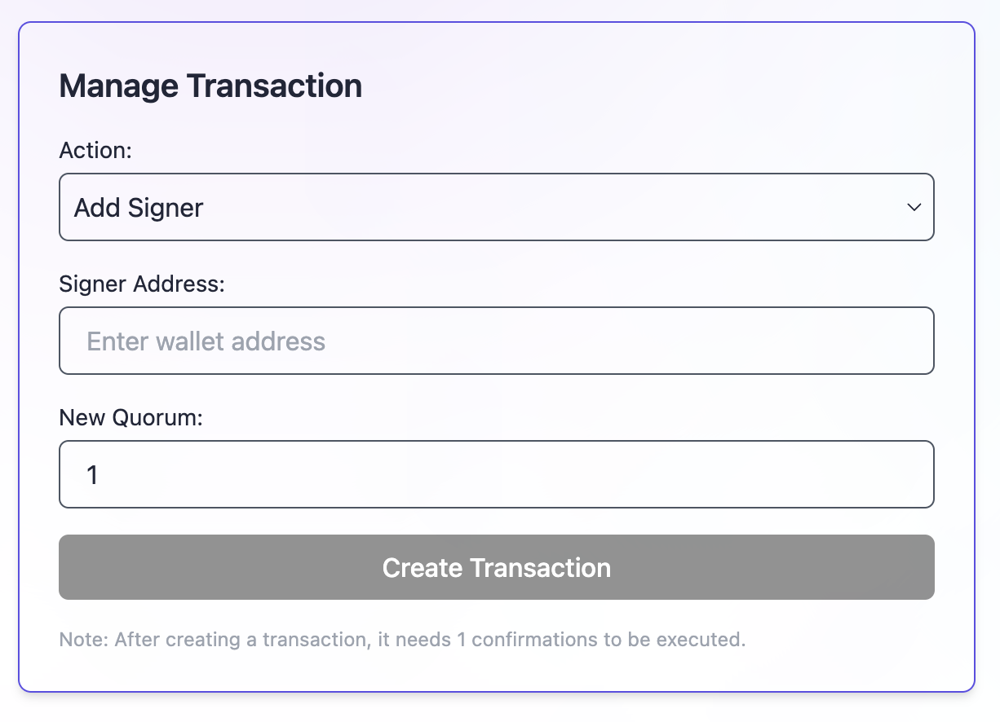
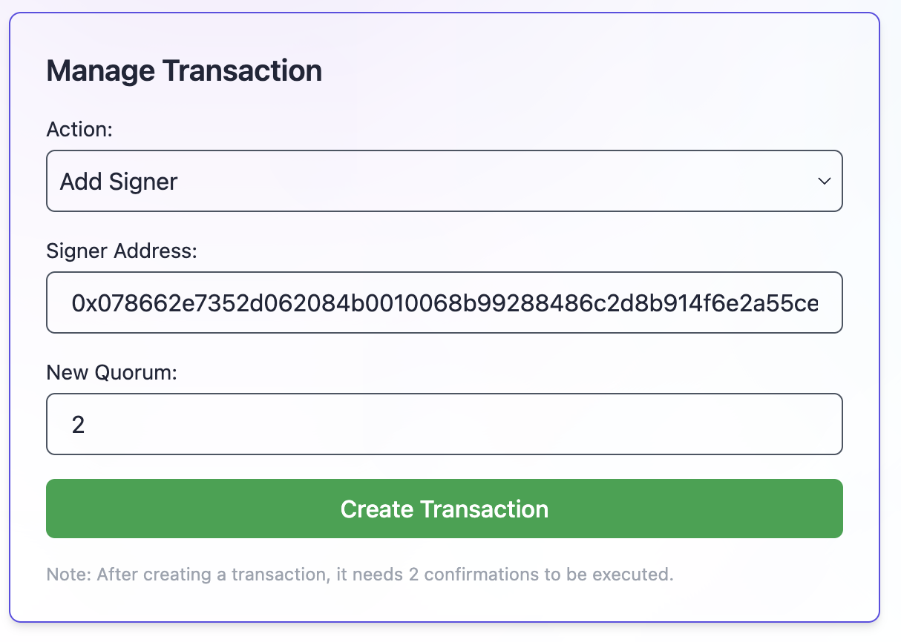
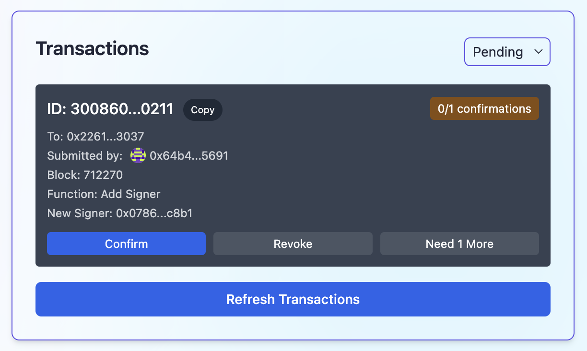
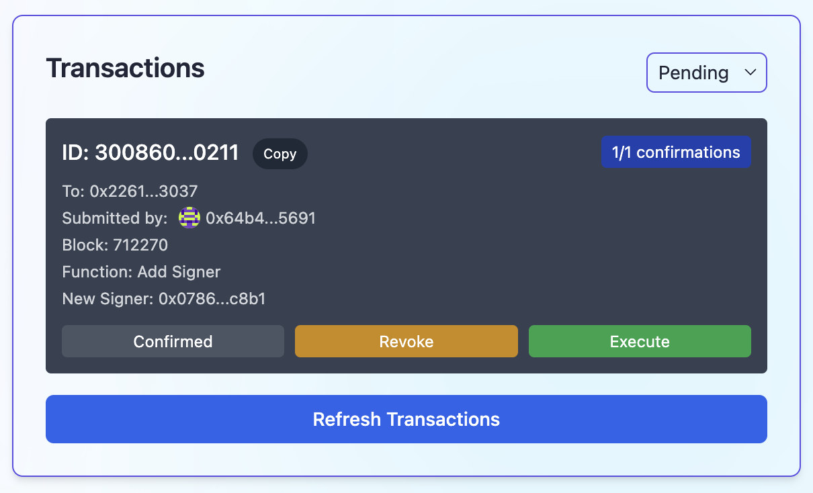
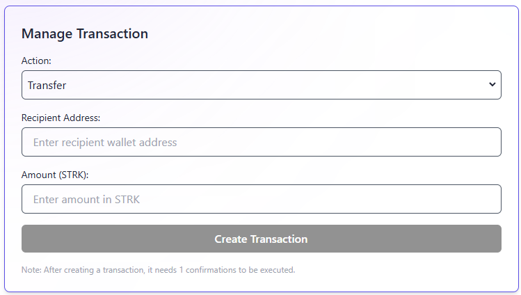
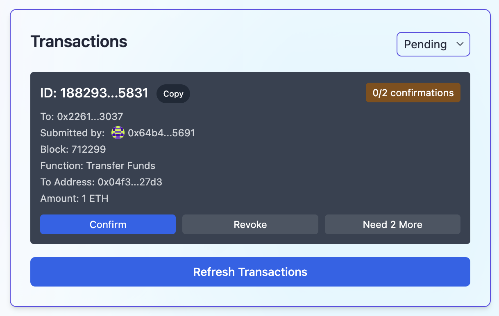
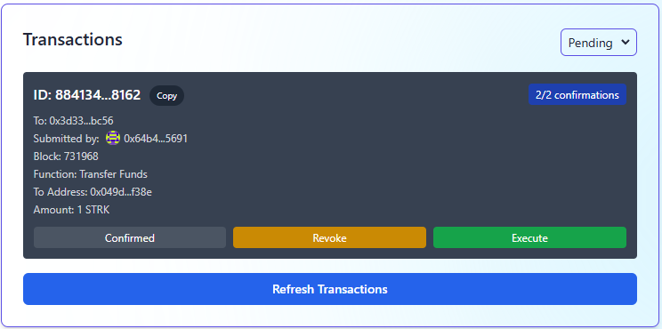

# 🚩 Challenge 5: 👛 Multisig Wallet


👩‍👩‍👧‍👧 A multisig wallet is a smart contract that acts like a wallet, allowing us to secure assets by requiring multiple accounts to "vote" on transactions. Think of it as a treasure chest that can only be opened when all key parties agree.

📜 The contract keeps track of all transactions. Each transaction can be confirmed or rejected by the signers (smart contract owners). Only transactions that receive enough confirmations can be "executed" by the signers.

🌟 The final deliverable is a multisig wallet where you can propose adding and removing signers, transferring funds to other accounts, and updating the required number of signers to execute a transaction. After any of the signers propose a transaction, it's up to the signers to confirm and execute it. Deploy your contracts to a testnet, then build and upload your app to a public web server.

📚 This tutorial is meant for developers that already understand the 🖍️ basics: [Starklings](https://starklings.app/) or [Node Guardians](https://nodeguardians.io/campaigns?f=3%3D2)

## 📜 Quest Journal 🧭

In this challenge you'll have access to a fully functional Multisig Wallet for inspiration, unlike previous challenges where certain code sections were intentionally left incomplete.

The objective is to allow builders to create their unique versions while referring to this existing build when encountering difficulties.

### 🥅 Goals:

- [ ] Can you edit and deploy the contract with a 2/3 multisig with two of your addresses?
- [ ] Can you propose basic transactions with the frontend that sends them to the backend?
- [ ] Can you “vote” on the transaction as other signers?
- [ ] Can you execute the transaction and does it do the right thing?
- [ ] Can you add and remove signers with a custom dialog (that just sends you to the create transaction dialog with the correct calldata)

### ⚔️ Side Quests:

- [ ] **Multisig as a service**<br>
      Create a deploy button with a copy-paste dialog for sharing so anyone can make a multisig at your URL with your frontend.

- [ ] **Create custom signer roles for your Wallet**<br>
      You may not want every signer to create new transfers, only allow them to sign existing transactions or a mega-admin role who will be able to veto any transaction.

- [ ] **Integrate this MultiSig wallet into other Scaffold Starknet-2 builds**<br>
      Find a Scaffold Starknet-2 build that could make use of a Multisig wallet and try to integrate it!

---

## 👇🏼 Quick Break-Down 👛

This is a smart contract that acts as an offchain signature-based shared wallet amongst different signers that showcases use of meta-transaction knowledge and ECDSA `recover()`.

> If you are unfamiliar with these concepts, check out all the [ETH.BUILD videos](https://www.youtube.com/watch?v=CbbcISQvy1E&ab_channel=AustinGriffith) by Austin Griffith, especially the Meta Transactions one!

❗ [OpenZepplin's ECDSA Library](https://docs.openzeppelin.com/contracts/2.x/api/cryptography#ECDSA) provides an easy way to verify signed messages, in this challenge we'll be using it to verify the signatures of the signers of the multisig wallet.

At a high-level, the contract core functions are carried out as follows:

**Offchain: ⛓🙅🏻‍♂️** - Generate a transaction information struct with the function selector and calldata, and hash it. It is signed by the signers associated to the multisig, and added to the `Multisig_tx_info` mapping.

**Onchain: ⛓🙆🏻‍♂️**

- New signers are added to the `Multisig_is_signer` mapping, to check if a signer is in the multisig, we check the `Multisig_is_signer` mapping.
- If it's a success, the tx is passed to the `execute_transaction(){}` function of the deployed MultiSigWallet contract (this contract), asserting is_signer for any possible calls to internal txs such as (`add_signer()`,`remove_signer()`,`transfer_funds()`,`change_quorum()`).

**Cool Stuff that is Showcased: 😎**

- Normal internal functions, such as changing the signers, and adding or removing signers, are treated as external function calls when `execute_transaction()` is used with the respective calldata.
- Showcases use of an array (see constructor) populating a mapping to store pertinent information within the deployed smart contract storage location within the EVM in a more efficient manner.

> 💬 Submit this challenge, meet other builders working on this challenge or get help in the [Builders telegram chat](https://t.me/+wO3PtlRAreo4MDI9)!

---

## Checkpoint 0: 📦 Environment 📚

Before you begin, you need to install the following tools:

- [Node (>= v22)](https://nodejs.org/en/download/)
- Yarn ([v1](https://classic.yarnpkg.com/en/docs/install/) or [v2+](https://yarnpkg.com/getting-started/install))
- [Git](https://git-scm.com/downloads)
- [Rust](https://rust-lang.org/tools/install)
- [asdf](https://asdf-vm.com/guide/getting-started.html)
- [Cairo 1.0 extension for VSCode](https://marketplace.visualstudio.com/items?itemName=starkware.cairo1)

### Starknet-devnet version

To ensure the proper functioning of scaffold-stark, your `starknet-devnet` version must match the version specified in [Compatible versions](#compatible-versions). To accomplish this, first check your `starknet-devnet` version:

```sh
starknet-devnet --version
```

If your `starknet-devnet` version is not the version specified in [Compatible versions](#compatible-versions), you need to install it.

- Install starknet-devnet via `asdf` ([instructions](https://github.com/gianalarcon/asdf-starknet-devnet/blob/main/README.md)). Use the exact version from [Compatible versions](#compatible-versions).

### Compatible versions

- Starknet-devnet - v0.7.2
- Scarb - v2.15.1
- Snforge - v0.55.0
- Cairo - v2.15.0
- Rpc - v0.10.x

Make sure you have the compatible versions otherwise refer to [Scaffold-Stark Requirements](https://github.com/Scaffold-Stark/scaffold-stark-2?.tab=readme-ov-file#requirements)

Make sure you have the compatible versions otherwise refer to [Scaffold-Stark Requirements](https://github.com/Scaffold-Stark/scaffold-stark-2?.tab=readme-ov-file#requirements)

Make sure you have the compatible versions otherwise refer to [Scaffold-Stark Requirements](https://github.com/Scaffold-Stark/scaffold-stark-2?.tab=readme-ov-file#requirements)

Make sure you have the compatible versions otherwise refer to [Scaffold-Stark Requirements](https://github.com/Scaffold-Stark/scaffold-stark-2?.tab=readme-ov-file#requirements)

Make sure you have the compatible versions otherwise refer to [Scaffold-Stark Requirements](https://github.com/Scaffold-Stark/scaffold-stark-2?.tab=readme-ov-file#requirements)

Make sure you have the compatible versions otherwise refer to [Scaffold-Stark Requirements](https://github.com/Scaffold-Stark/scaffold-stark-2?.tab=readme-ov-file#requirements)

Make sure you have the compatible versions otherwise refer to [Scaffold-Stark Requirements](https://github.com/Scaffold-Stark/scaffold-stark-2?.tab=readme-ov-file#requirements)

Make sure you have the compatible versions otherwise refer to [Scaffold-Stark Requirements](https://github.com/Scaffold-Stark/scaffold-stark-2?.tab=readme-ov-file#requirements)

Make sure you have the compatible versions otherwise refer to [Scaffold-Stark Requirements](https://github.com/Scaffold-Stark/scaffold-stark-2?.tab=readme-ov-file#requirements)

Make sure you have the compatible versions otherwise refer to [Scaffold-Stark Requirements](https://github.com/Scaffold-Stark/scaffold-stark-2?.tab=readme-ov-file#requirements)

Make sure you have the compatible versions otherwise refer to [Scaffold-Stark Requirements](https://github.com/Scaffold-Stark/scaffold-stark-2?.tab=readme-ov-file#requirements)

Make sure you have the compatible versions otherwise refer to [Scaffold-Stark Requirements](https://github.com/Scaffold-Stark/scaffold-stark-2?.tab=readme-ov-file#requirements)

Make sure you have the compatible versions otherwise refer to [Scaffold-Stark Requirements](https://github.com/Scaffold-Stark/scaffold-stark-2?.tab=readme-ov-file#requirements)

Make sure you have the compatible versions otherwise refer to [Scaffold-Stark Requirements](https://github.com/Scaffold-Stark/scaffold-stark-2?.tab=readme-ov-file#requirements)
### Docker Option for Environment Setup

<details>

For an alternative to local installations, you can use Docker to set up the environment.

- Install [Docker](https://www.docker.com/get-started/) and [VSCode Dev Containers extension](https://marketplace.visualstudio.com/items?itemName=ms-vscode-remote.remote-containers).
- A pre-configured Docker environment is provided via `devcontainer.json` using the `starknetfoundation/starknet-dev` image with the Scarb version specified in [Compatible versions](#compatible-versions).

For complete instructions on using Docker with the project, check out the [Requirements Optional with Docker section in the README](https://github.com/Scaffold-Stark/scaffold-stark-2?tab=readme-ov-file#requirements-alternative-option-with-docker) for setup details.

</details>

Then download the challenge to your computer and install dependencies by running:

```sh
npx create-stark@latest -e challenge-5-multisig-wallet challenge-5-multisig-wallet
cd challenge-5-multisig-wallet
yarn install
```

or clone from SpeedrunStark repo:

```sh
git clone https://github.com/Scaffold-Stark/speedrunstark.git challenge-5-multisig-wallet
cd challenge-5-multisig-wallet
git checkout challenge-5-multisig-wallet
yarn install
```

> in the same terminal, start your local network (a blockchain emulator in your computer):

```bash
yarn chain
```

> To run a fork : `yarn chain --fork-network <URL> [--fork-block <BLOCK_NUMBER>]`

> in a second terminal window, 🛰 deploy your contract (locally):

```sh
cd challenge-5-multisig-wallet
yarn deploy
```

> in a third terminal window, start your 📱 frontend:

```sh
cd challenge-5-multisig-wallet
yarn start
```

📱 Open <http://localhost:3000> to see the app.

> 👩‍💻 Rerun `yarn deploy` whenever you need to deploy completely new contracts to the frontend. If you want to keep previous deployments and avoid overwriting changes, use `yarn deploy:no-reset` instead.

---

## Checkpoint 1: 📝 Configure Signers 🖋

🔏 The owner of the multisig wallet is the first address in the `signers` array if you look at the deploy script `packages/snfoundry/scripts-ts/deploy.ts`.

🏗️ This is done in the constructor of the contract, where you can pass in a address that will be the first owner of the wallet, and a number of signatures required to execute a transaction.

You can set the rest of the signers in the frontend, using the "Manage Transaction" section:

In this tab you can start your transaction proposal to either add or remove owners.



> 📝 You can add or remove signers, and update the quorum. Fill the form and click on "Create transaction". 

> Quorum is the number of signatures required to execute a transaction.



> You will see the new transaction in the UI (this is all offchain)..



> Click on "Execute" to execute it, will be marked as "Completed", and will appear in the "Transaction Events" section with the rest of executed transactions.



> You have successfully added a new signer to the multisig wallet.

---

## Checkpoint 2: Transfer Funds 💸

> 💰 Use the faucet to send your multisig contract some funds.
> You can find the address in the "Wallet Information" section and "Debug Contracts" tabs.

> Create a transaction in the "Manage Transaction" section to send some funds to one of your signers, or to any other address of your choice:



> If you set the new quorum to 2, you will need a second signature to execute the transaction.



> Open another browser and access with a different owner of the multisig. Sign the transaction with enough owners:



> Execute the transaction to transfer the funds

## Checkpoint 3: 💾 Deploy your contracts! 🛰

📡 Find the `packages/nextjs/scaffold.config.ts` file and change the `targetNetworks` to `[chains.sepolia]`.


🔐 Prepare your environment variables.

> Find the `packages/snfoundry/.env` file and fill the env variables related to Sepolia testnet with your own wallet account address and private key.

⛽️ You will need to get some `STRK` Sepolia tokens to deploy your contract to Sepolia testnet.

🚀 Run `yarn deploy --network [network]` to deploy your smart contract to a public network (mainnet or sepolia).

> 💬 Hint: you input `yarn deploy --network sepolia`.

---

## Checkpoint 4: 🚢 Ship your frontend! 🚁

> 🦊 Since we have deployed to a public testnet, you will now need to connect using a wallet you own(Argent X or Braavos).

💻 View your frontend at <http://localhost:3000/multisig> and verify you see the correct network.

📡 When you are ready to ship the frontend app...

📦 Run `yarn vercel` to package up your frontend and deploy.

> Follow the steps to deploy to Vercel. Once you log in (email, github, etc), the default options should work. It'll give you a public URL.

> If you want to redeploy to the same production URL you can run `yarn vercel --prod`. If you omit the `--prod` flag it will deploy it to a preview/test URL.

#### Configuration of Third-Party Services for Production-Grade Apps

By default, 🏗 Scaffold-Stark provides predefined Open API endpoint for some services such as Blast. This allows you to begin developing and testing your applications more easily, avoiding the need to register for these services.
This is great to complete your **SpeedRunStark**.

For production-grade applications, it's recommended to obtain your own API keys (to prevent rate limiting issues). You can configure these at:

🔷 `RPC_URL_SEPOLIA` variable in `packages/snfoundry/.env` and `packages/nextjs/.env.local`. You can create API keys from the [Alchemy dashboard](https://dashboard.alchemy.com/).

> 💬 Hint: It's recommended to store env's for nextjs in Vercel/system env config for live apps and use .env.local for local testing.

---

> 🏃 Head to your next challenge [here](https://speedrunstark.com/).

> 💬 Problems, questions, comments on the stack? Post them to the [🏗 scaffold-stark developers chat](https://t.me/+wO3PtlRAreo4MDI9)
